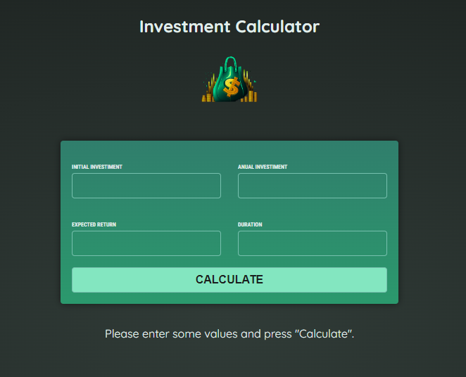

# Investment Calculator




## Sobre o Projeto

[Confira em funcionamento!](https://investment-calculator-taupe.vercel.app)

Investment Calculator é uma aplicação desenvolvida em Angular TS. Este projeto foi um desafio proposto pelo professor [Maximilian Schwarzmüller](https://www.udemy.com/user/maximilian-schwarzmuller/) em seu curso [Angular - The Complete Guide (2024 Edition)](https://www.udemy.com/course/the-complete-guide-to-angular-2/). O objetivo é aplicar os conhecimentos adquiridos no curso antes de conferir a solução proposta pelo instrutor.

## Funcionalidades

- **Cálculo de Investimentos:** Permite calcular o retorno de investimentos com base em diferentes parâmetros.
- **Interface Intuitiva:** Fácil de usar, com uma interface amigável e responsiva.

## Tecnologias Utilizadas

- **Angular TS:** Framework principal usado para desenvolver a aplicação.
- **TypeScript:** Linguagem de programação utilizada.
- **IntelliJ IDEA:** IDE utilizada para o desenvolvimento.

## Como Rodar o Projeto em Seu Computador

1. Clone o repositório:
    ```bash
    git clone https://github.com/LucasWithBoots/investment-calculator.git
    ```
2. Navegue até o diretório do projeto:
    ```bash
    cd investment-calculator
    ```
3. Instale as dependências:
    ```bash
    npm install
    ```
4. Inicie a aplicação:
    ```bash
    ng serve
    ```
5. Abra o navegador e acesse:
    ```
    http://localhost:4200
    ```
